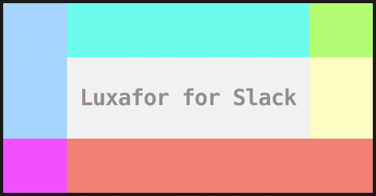

To Scholars@Work students: Please feel to reach out here and periodically follow up and new content will be shared.  
Good luck with your studies and thanks for letting us join you in your journey with technology!   -Vandy

## First things first:  
All you need to get rolling is Node.js.  (that will also install npm) 
npm is used below in the Installation Steps and is a package manager to automatically get all your dependencies.

Click here: https://nodejs.org/en/   then choose the version you want for your OS ( Mac, Windows, Linux )

<p align="center">
  
  <br>
</p>

#### Luxafor for Slack CLI

Make your [Luxafor](http://luxafor.com/) light change colours in sync with your [Slack](https://slack.com/) statuses.

**Green**: Active  
**Red**: Away / Do Not Disturb

## Install

```shell or bash
$ git clone https://github.com/scholarsatwork/LuxaforAndSlack
$ cd LuxaforAndSlack
$ npm i
$ npm run start
```

### Credentials

The following Slack API credentials are required to use this program:

* User **Token** _(generate a token [here](https://api.slack.com/web))_
* Client **ID** & **Secret** _(generated by creating a [slack application](https://api.slack.com/applications))_

In running this program, you will be prompted to provide these three required credentials.

## Todo

* Allow user to configure Luxafor USB device colors based on DnD status updates to a particular USER in Slack.

  You will have to setup a "Slack App" with access to your channel of choice. 
  For Instructions on how to setup a "Slack App" go [here](https://api.slack.com/slack-apps)

* NOTE: For the moment we are using a USER 'legacy token' and BOT Client ID and Client Secret.

The BOT is a "Slack App" and the User Token is a "Legacy Token" (That may get depracated at some point)

## Contribute

### Issues

Feel free to open issues with questions or requests.

However, this is a fun one-off project, so my responses may be slow.

### Develop

Install dependencies.

```shell or bash
$ git clone https://github.com/scholarsatwork/LuxaforAndSlack
$ cd LuxaforAndSlack
$ npm i
$ npm run start
```

* For this to work you will need to install luxafor-api and luxafor-for-slack in global

* You may need to take ownership of some directories depending on your permissions and disk owner/ access rights. 

Credentials are managed by [configstore](https://github.com/yeoman/configstore).
Previously saved credentials will be saved in  ../.config/luxafor-for-slack

## Credits

To all the authors that wrote the dependencies.
To https://github.com/loklaan/luxafor-for-slack/commits?author=loklaan for the code base and idea.
